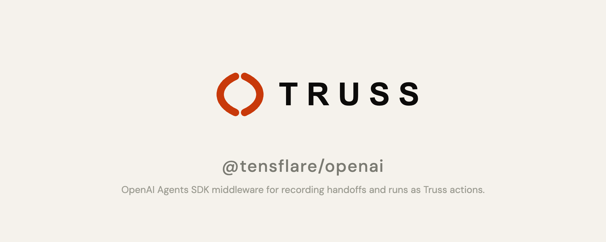

# @tensflare/openai

**OpenAI Agents SDK middleware — wraps agent handoffs and runs to record them as Truss actions.**

[](https://www.npmjs.com/package/@tensflare/openai)
[](LICENSE)
[](https://github.com/tensflare/truss-openai/actions)

---

## What is Truss?

Truss is an **accountability layer for AI agents** — it records every agent action as a cryptographically signed, tamper-evident audit trail. [Learn more →](https://truss.tensflare.com/docs)

## Overview

Wrap OpenAI Agents SDK handoff handlers and run handlers to automatically compute SHA-256 hashes and POST `openai_handoff` and `openai_agent_run` action records to the Truss API. **Fail-open** — operations proceed normally even if recording fails.

## Installation

```bash
npm install @tensflare/openai
```

## Quick start

```typescript
import { TrussOpenAIMiddleware } from "@tensflare/openai";

const truss = new TrussOpenAIMiddleware({
  apiUrl: "http://localhost:4000",
  apiKey: "tr_your_api_key",
  mandateId: "mnd_001",
});

// Wrap agent-to-agent handoffs
const wrappedHandoff = truss.wrapHandoff(myHandoffHandler);

// Wrap agent run execution
const wrappedRun = truss.wrapRun(myRunHandler);
```

## API

### `new TrussOpenAIMiddleware(options)`

| Option | Type | Description |
|---|---|---|
| `apiUrl` | `string` | Truss API base URL |
| `apiKey` | `string` | Truss API key |
| `mandateId` | `string` | Mandate ID to record actions under |

### `middleware.wrapHandoff(handoffFn)`

Wraps a handoff handler `(event: HandoffEvent) => Promise<unknown>`. Records `openai_handoff` actions.

### `middleware.wrapRun(runFn)`

Wraps a run handler `(input: AgentRunInput) => Promise<unknown>`. Records `openai_agent_run` actions.

## Related packages

| Package | Description |
|---|---|
| [@tensflare/sk](https://github.com/tensflare/truss-sk) | Semantic Kernel middleware (same pattern) |
| [@tensflare/llamaindex](https://github.com/tensflare/truss-llamaindex) | LlamaIndex middleware (same pattern) |
| [@tensflare/truss-sdk](https://github.com/tensflare/truss-sdk-js) | TypeScript SDK |
| [@tensflare/tap](https://github.com/tensflare/truss-tap) | Core Zod schemas |

## Development

```bash
npm install
npm run build
npm test
```

## Contributing

Pull requests are welcome. Please see the [contribution guidelines](https://truss.tensflare.com/docs/contributing).

## License

Apache 2.0 — see [LICENSE](LICENSE).
